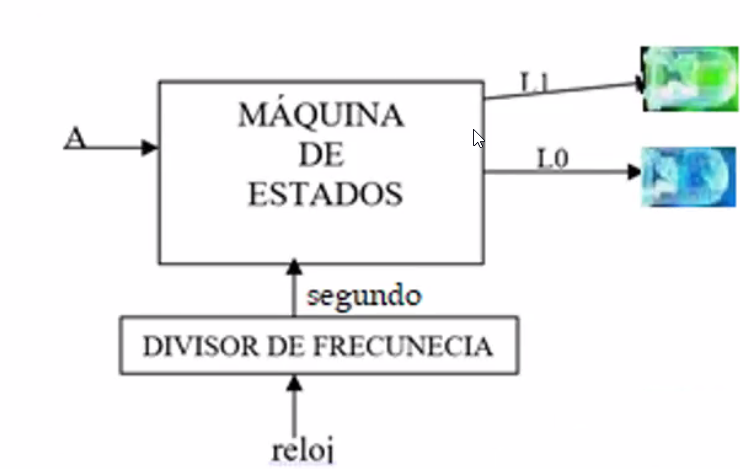
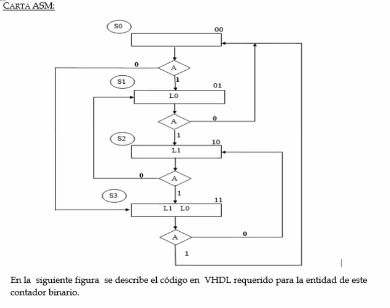

<!-- _backgroundColor: #ce0000;-->
<!-- _class: portada -->
<!-- _paginate: false -->


Víctor Miguel Barrera Peña 
Práctica 11. Diseño de cartas ASM
M.I. Norma Elva Chavez Rodriguez
Laboratorio Diseño Digital Moderno 1645
2022-1


---

# Objetivo

El alumno comprenderá utilizando lenguaje VHDL, el funcionamiento y manejo de cartas ASM para la creación de máquinas de estados, las cuales controlan sistemas secuenciales con gran diversidad de salidas. También aprenderán a crear sus propias bibliotecas.

---

# Especificaciones

Diseñar y construir, un contador que cuente en forma ascendente/descendente los números binarios del cero al tres, cuando el valor de la variable A sea uno la cuenta se efectuará de forma ascendente $y$ si el valor de la variable A es cero la cuenta se efectuará en forma descendente. El cambio de cuenta de ascendente a descendente y viceversa se puede efectuar en cualquier estado. 

---

# Diagrama de bloques	



---

# Carta ASM



---

# Código en lenguaje VHDL

```vhdl
library IEEE;
use IEEE.std_logic_1164.ALL;
use IEEE.std_logic_arith.ALL;
use IEEE.std_logic_unsigned.ALL;
entity ASM is
	port(
		reloj: in std_logic;
		A: in std_logic;
		L:out std_logic_vector(2 downto 0)
        	--aquí agrego
	);
end ASM;
```

---

```vhdl
architecture Behavioral of ASM is
	type estados is (s0,s1,s2,s3);
	signal epresente,esiguiente:estados;
	signal segundo: std_logic;
```
---

```vhdl
begin
	divisor: process (reloj)
		variable cuenta:std_logic_vector(27 downto 0):=X"0000000";
		begin
			if rising_edge(reloj) then
				if cuenta=X"48009E0" then --es el tiempo 1.51 seg
					cuenta:=X"0000000";
				else
					cuenta:= cuenta+1;
				end if;
			end if;
			segundo<= cuenta(24);
		end process;
```
---

```vhdl
	MdE1: process (segundo) --transicion
		begin
			if rising_edge(segundo) then
				epresente <=esiguiente;
			end if;
		end process;
```
---

```vhdl
	MdE2: process (epresente,A)
		begin
			case epresente is
				when s0 =>
					L<= "001";
					if A='1' then
						esiguiente <=s1;
					else
						esiguiente <=s3;
					end if;
				when s1 =>
					L<= "011";
					if A='1' then
						esiguiente<=s2;
					else
						esiguiente <=s0;
					end if;
				when s2 =>
					L<="101";
                    if A='1' then
                    esiguiente<=s3;
                    else
                    esiguiente<=s1;
                    end if;
				when s3 =>
					L<="111";
					if A='1' then
						esiguiente<=s0;
					else
						esiguiente<=s2;
					end if;
			end case;
	end process;
end Behavioral;		
```

---


Si tus display están en paralelo agrega lo siguiente:

y agregar la siguiente variable en la línea 8

```
Dig: out STD_LOGIC_VECTOR(4 downto 1);
```

 en la línea 20.

```vhdl
with A select
Dig <= "1110" when "000",
	"1110" when others;
```
